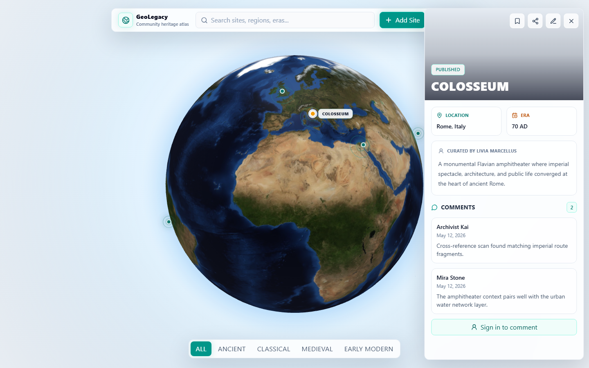

# GeoLegacy

GeoLegacy là một ứng dụng web giúp khám phá các địa danh lịch sử trên bản đồ quả địa cầu 3D. Người dùng có thể xem thông tin từng địa danh, tìm kiếm theo thời kỳ hoặc khu vực, lưu địa điểm yêu thích, bình luận, và đóng góp địa danh mới cho cộng đồng.

Điểm chính của dự án là dữ liệu không chỉ nằm ở frontend. Ứng dụng có Supabase làm backend, có đăng nhập, phân quyền, lưu landmark vào database, upload ảnh, kiểm duyệt bài gửi mới và khu vực quản trị riêng cho admin.

Link demo:

```text
https://ge0legacy.vercel.app
```

Lưu ý: domain là `ge0legacy` với số `0`, không phải chữ `o`.

## Demo



## Mục lục

- [Tính năng](#tính-năng)
- [Công nghệ sử dụng](#công-nghệ-sử-dụng)
- [Cấu trúc thư mục](#cấu-trúc-thư-mục)
- [Cài đặt dự án](#cài-đặt-dự-án)
- [Cấu hình Supabase](#cấu-hình-supabase)
- [Cấu hình Google Account Linking](#cấu-hình-google-account-linking)
- [Tạo tài khoản admin](#tạo-tài-khoản-admin)
- [Luồng hoạt động chính](#luồng-hoạt-động-chính)
- [Scripts](#scripts)
- [Database](#database)
- [Deploy lên Vercel](#deploy-lên-vercel)
- [Lỗi thường gặp](#lỗi-thường-gặp)
- [Ghi chú bảo mật](#ghi-chú-bảo-mật)

## Tính năng

### Khám phá địa danh

- Hiển thị các landmark trên quả địa cầu 3D.
- Click vào từng điểm để xem ảnh, mô tả, khu vực, thời kỳ và người đóng góp.
- Tìm kiếm theo tên, khu vực, thời kỳ, nội dung mô tả hoặc tác giả.
- Lọc theo nhóm thời kỳ: Ancient, Classical, Medieval, Early Modern.
- Chia sẻ link trực tiếp tới từng landmark bằng query `?site=<id>`.
- Giao diện responsive cho desktop và mobile.

### Tài khoản người dùng

- Đăng ký và đăng nhập bằng email/password qua Supabase Auth.
- Cập nhật hồ sơ cá nhân: tên hiển thị, ảnh đại diện, bio, khu vực, website.
- Liên kết tài khoản Google với tài khoản đã tạo sẵn để tăng độ an toàn.
- Bookmark các landmark yêu thích.
- Bình luận vào các landmark đã được publish.
- Gửi landmark mới để chờ admin duyệt.

### Quản trị website

Admin có khu vực riêng trong menu người dùng. Các chức năng chính:

- Xem thống kê tổng quan: số landmark, số bài pending, số user, số comment.
- Xem toàn bộ landmark, bao gồm cả `pending` và `published`.
- Approve landmark mới bằng cách chuyển trạng thái sang `published`.
- Unpublish landmark nếu cần ẩn lại.
- Chỉnh sửa thông tin landmark: tên, era, region, mô tả, tọa độ, ảnh, trạng thái.
- Xóa landmark không hợp lệ.
- Xem danh sách user và đổi role giữa `user` và `admin`.
- Xem và xóa comment.

### Backend và phân quyền

- Dữ liệu landmark được lưu trong Supabase PostgreSQL.
- Landmark do user gửi sẽ có trạng thái `pending`.
- User thường chỉ thấy landmark `published`.
- Admin có quyền xem và quản lý tất cả landmark.
- Row Level Security được bật cho các bảng chính.
- Trigger trong database chặn user thường tự nâng quyền hoặc tự publish bài của mình.

## Công nghệ sử dụng

| Nhóm | Công nghệ |
| --- | --- |
| Frontend | React 18, Vite 6 |
| Styling | Tailwind CSS 4 |
| 3D Globe | react-globe.gl, Three.js |
| Animation | Framer Motion |
| State management | Zustand |
| Icon | Lucide React |
| Backend | Supabase Auth, PostgreSQL, Storage |
| Deploy | Vercel |

## Cấu trúc thư mục

```text
GeoLegacy/
+-- src/
|   +-- components/
|   |   +-- AdminReviewModal.jsx   # Admin Console
|   |   +-- AppHeader.jsx          # Header, search, add site, user menu
|   |   +-- AuthModal.jsx          # Dang nhap / dang ky
|   |   +-- AuthProvider.jsx       # Quan ly session Supabase
|   |   +-- GlobeComponent.jsx     # Qua dia cau 3D
|   |   +-- ProfileModal.jsx       # Ho so nguoi dung va link Google
|   |   +-- SidePanel.jsx          # Chi tiet landmark, comment, bookmark
|   |   +-- UploadModal.jsx        # Form gui landmark moi
|   |   +-- UserMenu.jsx           # Menu tai khoan, admin console, logout
|   +-- data/
|   |   +-- landmarks.js           # Du lieu fallback/default
|   +-- hooks/
|   |   +-- useMediaQuery.js
|   |   +-- useWindowSize.js
|   +-- lib/
|   |   +-- supabaseClient.js      # Khoi tao Supabase client
|   +-- services/
|   |   +-- admin.js               # API cho admin
|   |   +-- auth.js                # Auth, profile, Google linking
|   |   +-- geocoding.js           # Tim toa do tu dia diem
|   |   +-- landmarks.js           # API landmark va upload anh
|   +-- store/
|   |   +-- useStore.js            # Zustand store
|   +-- App.jsx
|   +-- index.css
|   +-- main.jsx
+-- supabase/
|   +-- bootstrap_admin.sql        # Tao quyen admin cho mot user
|   +-- schema.sql                 # Database schema, RLS, seed data, storage
|   +-- verify_setup.sql           # Script kiem tra setup
+-- .env.example
+-- package.json
+-- tailwind.config.js
+-- vite.config.js
```

## Cài đặt dự án

### Yêu cầu

- Node.js 18 trở lên
- npm
- Tài khoản Supabase
- Tài khoản Google Cloud nếu muốn bật liên kết Google

### Clone repo

```bash
git clone https://github.com/lquan-tech/GeoLegacy.git
cd GeoLegacy
```

### Cài dependencies

```bash
npm install
```

### Tạo file môi trường

Trên Windows:

```bash
copy .env.example .env
```

Trên macOS/Linux:

```bash
cp .env.example .env
```

Cập nhật `.env`:

```env
VITE_SUPABASE_URL=https://your-project-ref.supabase.co
VITE_SUPABASE_ANON_KEY=your-supabase-anon-or-publishable-key
VITE_AUTH_REDIRECT_URL=http://localhost:5173/
```

Trong đó:

- `VITE_SUPABASE_URL`: URL project Supabase.
- `VITE_SUPABASE_ANON_KEY`: anon key hoặc publishable key của Supabase.
- `VITE_AUTH_REDIRECT_URL`: URL fallback cho auth redirect khi chạy local.

Có thể lấy Supabase URL và key tại:

```text
Supabase Dashboard > Project Settings > API
```

### Chạy local

```bash
npm run dev
```

Mở trình duyệt:

```text
http://localhost:5173
```

## Cấu hình Supabase

### 1. Tạo project Supabase

Vào Supabase, tạo project mới. Sau khi project sẵn sàng, mở SQL Editor.

### 2. Chạy schema

Copy toàn bộ nội dung file dưới đây và chạy trong SQL Editor:

```text
supabase/schema.sql
```

File này sẽ tạo:

- bảng `profiles`
- bảng `landmarks`
- bảng `comments`
- bảng `bookmarks`
- index tìm kiếm
- helper function `is_admin`
- trigger tạo profile sau khi user đăng ký
- trigger cập nhật `updated_at`
- trigger chặn user thường tự đổi role
- trigger chặn user thường tự publish landmark
- RLS policies
- seed landmark mẫu
- bucket `landmark-images`
- policy upload/read ảnh

### 3. Kiểm tra setup

Sau khi chạy schema, có thể chạy thêm:

```text
supabase/verify_setup.sql
```

Script này giúp kiểm tra nhanh các bảng, trigger, policy và profile đã được tạo đúng chưa.

### 4. Bật Email Auth

Trong Supabase Dashboard:

```text
Authentication > Providers > Email
```

Bật Email provider. Khi demo, nếu muốn đăng nhập ngay không cần xác nhận email, có thể tạo user thủ công trong:

```text
Authentication > Users > Add user
```

và bật `Auto Confirm User`.

### 5. Cấu hình URL cho Auth

Vào:

```text
Authentication > URL Configuration
```

Khi chạy local:

```text
Site URL:
http://localhost:5173

Redirect URLs:
http://localhost:5173
http://127.0.0.1:5173
```

Khi deploy production:

```text
Site URL:
https://ge0legacy.vercel.app

Redirect URLs:
https://ge0legacy.vercel.app
```

Nếu deploy sang domain khác, thêm domain đó vào đây.

## Cấu hình Google Account Linking

Tính năng này dùng để liên kết một tài khoản Google với tài khoản email/password đã có sẵn trong GeoLegacy.

Luồng hiện tại:

1. User đăng nhập bằng email/password.
2. User mở Profile Center.
3. User bấm Link Google.
4. App mở Google Identity popup.
5. Supabase liên kết Google identity vào user hiện tại.
6. UI hiển thị email Google đã link, ví dụ `quanl...@vku.udn.vn`.

### 1. Tạo OAuth Client trên Google Cloud

Vào Google Cloud Console:

```text
Google Auth Platform > Clients > Create Client
```

Chọn:

```text
Application type: Web application
```

### 2. Thêm Authorized JavaScript origins

Với production:

```text
https://ge0legacy.vercel.app
```

Với local:

```text
http://localhost:5173
http://127.0.0.1:5173
```

Không thêm dấu `/` ở cuối.

Đúng:

```text
https://ge0legacy.vercel.app
```

Sai:

```text
https://ge0legacy.vercel.app/
https://ge0legacy.vercel.app/auth/callback
```

### 3. Thêm Authorized redirect URI

Redirect URI phải là callback URL của Supabase:

```text
https://your-project-ref.supabase.co/auth/v1/callback
```

Với project hiện tại:

```text
https://coqfzlzcvvzclblbsuck.supabase.co/auth/v1/callback
```

Không dùng URL Vercel ở mục này. Google sẽ redirect về Supabase trước.

### 4. Gắn Client ID và Client Secret vào Supabase

Vào Supabase:

```text
Authentication > Providers > Google
```

Bật Google provider, sau đó nhập:

- Client ID
- Client Secret

Lưu lại cấu hình.

### 5. Bật Manual Linking

Trong Supabase Auth settings, bật Manual Linking. Nếu không bật, `linkIdentity()` sẽ bị Supabase từ chối.

### 6. Test

1. Đăng nhập bằng email/password.
2. Mở menu tài khoản.
3. Chọn View Profile.
4. Ở Security Links, bấm Link Google.
5. Chọn tài khoản Google.
6. Nếu thành công, profile sẽ hiện:

```text
Linked to <email-google-rút-gọn>
```

## Tạo tài khoản admin

Admin không được tạo bằng frontend. Quyền admin nằm trong database tại:

```text
public.profiles.role = 'admin'
```

### 1. Tạo user trong Supabase Auth

Vào:

```text
Authentication > Users > Add user
```

Ví dụ:

```text
Email: admin@geolegacy.local
Password: chọn mật khẩu mạnh
Auto Confirm User: enabled
```

### 2. Promote user thành admin

Chạy file sau trong Supabase SQL Editor:

```text
supabase/bootstrap_admin.sql
```

Mặc định file này promote email:

```text
admin@geolegacy.local
```

Nếu muốn dùng email khác, sửa email trong `bootstrap_admin.sql` trước khi chạy.

### 3. Mở Admin Console

1. Đăng nhập GeoLegacy bằng tài khoản admin.
2. Mở menu tài khoản ở góc trên.
3. Chọn Admin Console.

## Luồng hoạt động chính

### User gửi landmark mới

1. User đăng nhập.
2. Bấm Add Site.
3. Nhập thông tin landmark.
4. Upload ảnh nếu có.
5. Submit.
6. App lưu landmark vào database với:

```text
status = pending
```

Landmark pending không hiển thị công khai cho user thường.

### Admin duyệt landmark

1. Admin đăng nhập.
2. Mở Admin Console.
3. Tìm landmark đang pending.
4. Kiểm tra và chỉnh sửa thông tin nếu cần.
5. Bấm Publish.
6. Landmark chuyển sang:

```text
status = published
```

Sau đó landmark sẽ xuất hiện trên globe cho tất cả người dùng.

### User tương tác với landmark

Với landmark đã published:

- User chưa đăng nhập có thể xem thông tin và chia sẻ link.
- User đã đăng nhập có thể bookmark và bình luận.
- Admin có thể chỉnh sửa hoặc xóa landmark.

## Scripts

Chạy dev server:

```bash
npm run dev
```

Build production:

```bash
npm run build
```

Preview production build:

```bash
npm run preview
```

## Database

### `profiles`

Lưu thông tin profile và role của user.

Các field chính:

- `id`
- `username`
- `display_name`
- `avatar_url`
- `bio`
- `home_region`
- `website_url`
- `role`
- `created_at`
- `updated_at`

Role hợp lệ:

```text
user
admin
```

### `landmarks`

Lưu dữ liệu địa danh.

Các field chính:

- `id`
- `slug`
- `title`
- `description`
- `lat`
- `lng`
- `era`
- `region`
- `image_url`
- `author_id`
- `status`
- `created_at`

Status hợp lệ:

```text
pending
published
```

### `comments`

Lưu bình luận của user trên landmark.

Các field chính:

- `id`
- `landmark_id`
- `user_id`
- `content`
- `created_at`

### `bookmarks`

Lưu landmark yêu thích theo từng user.

Các field chính:

- `user_id`
- `landmark_id`
- `created_at`

Khóa chính là:

```text
(user_id, landmark_id)
```

Nhờ vậy một user không thể bookmark trùng cùng một landmark.

## Deploy lên Vercel

### Cấu hình project

Khi import repo vào Vercel, dùng cấu hình:

```text
Framework Preset: Vite
Build Command: npm run build
Output Directory: dist
Install Command: npm install
```

### Environment Variables

Trong Vercel:

```text
Project Settings > Environment Variables
```

Thêm:

```env
VITE_SUPABASE_URL=https://your-project-ref.supabase.co
VITE_SUPABASE_ANON_KEY=your-supabase-anon-or-publishable-key
VITE_AUTH_REDIRECT_URL=https://your-production-domain/
```

Với domain hiện tại:

```env
VITE_AUTH_REDIRECT_URL=https://ge0legacy.vercel.app/
```

### Sau khi deploy

Nhớ cập nhật production domain ở:

1. Supabase Authentication > URL Configuration.
2. Google Cloud OAuth Client > Authorized JavaScript origins.

Với domain hiện tại, Google origin là:

```text
https://ge0legacy.vercel.app
```

## Lỗi thường gặp

### Thêm landmark xong F5 thì bị mất

Nếu user thường submit landmark mới, landmark đó được lưu với trạng thái `pending`. User thường không thấy pending landmark sau khi refresh.

Cách kiểm tra:

1. Đăng nhập admin.
2. Mở Admin Console.
3. Vào danh sách landmark.
4. Tìm bài pending vừa submit.
5. Publish nếu muốn hiển thị công khai.

### Không thấy Admin Console

Tài khoản hiện tại chưa có role admin.

Cách sửa:

1. Tạo hoặc chọn một user trong Supabase Auth.
2. Sửa email trong `supabase/bootstrap_admin.sql` nếu cần.
3. Chạy `bootstrap_admin.sql`.
4. Đăng xuất rồi đăng nhập lại.

### Profile báo cần setup backend

Auth đăng nhập được, nhưng bảng `public.profiles` chưa đúng hoặc chưa tồn tại.

Cách sửa:

```text
Chạy lại supabase/schema.sql trong Supabase SQL Editor.
```

Sau đó refresh app.

### Google popup could not open

Google chưa cho phép domain hiện tại gọi popup.

Cách sửa trong Google Cloud OAuth Client:

```text
Authorized JavaScript origins:
https://ge0legacy.vercel.app
http://localhost:5173
http://127.0.0.1:5173
```

Chỉ thêm những domain thật sự dùng.

### Unable to exchange external code

Lỗi này thường do Google OAuth Client Secret hoặc redirect URI sai.

Kiểm tra Google Cloud OAuth Client > Authorized redirect URIs:

```text
https://your-project-ref.supabase.co/auth/v1/callback
```

Với project hiện tại:

```text
https://coqfzlzcvvzclblbsuck.supabase.co/auth/v1/callback
```

Sau đó kiểm tra lại Supabase:

```text
Authentication > Providers > Google
```

Đảm bảo Client ID và Client Secret đúng với OAuth client đang dùng.

### Upload ảnh không được

Kiểm tra đã chạy `supabase/schema.sql` chưa. File này tạo bucket:

```text
landmark-images
```

Upload chỉ cho phép user đã đăng nhập upload vào path:

```text
pending/<user-id>/
```

### User thường thấy landmark pending

Kiểm tra RLS policy của bảng `landmarks`. Policy select đúng phải giới hạn:

```sql
status = 'published'
or public.is_admin(auth.uid())
```

Nếu policy bị thiếu hoặc sai, chạy lại `supabase/schema.sql`.


## License

MIT. Có thể sử dụng, chỉnh sửa và phân phối lại theo điều khoản của license.
